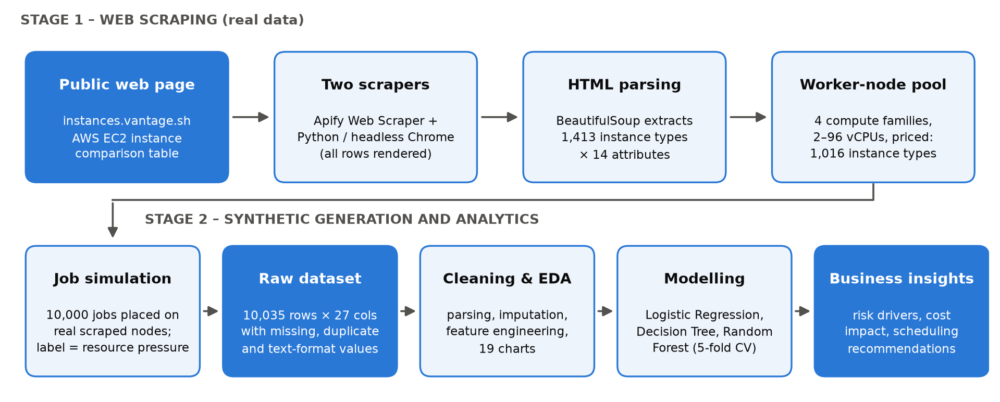
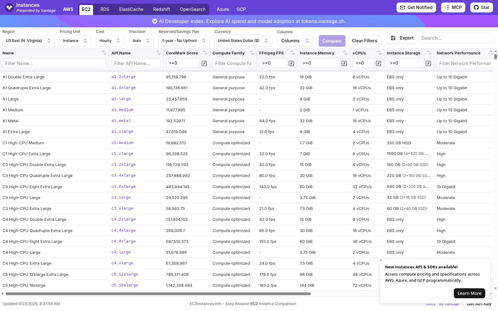
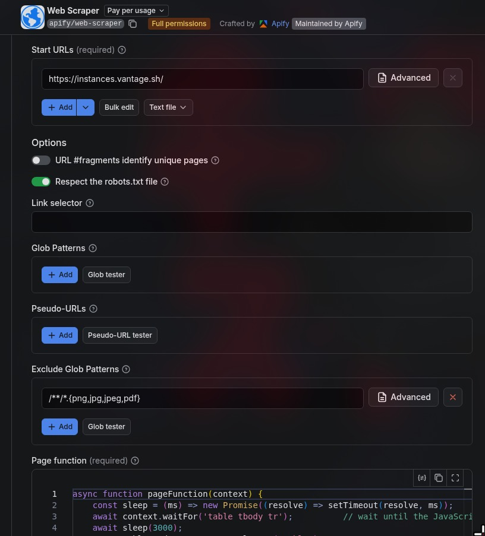
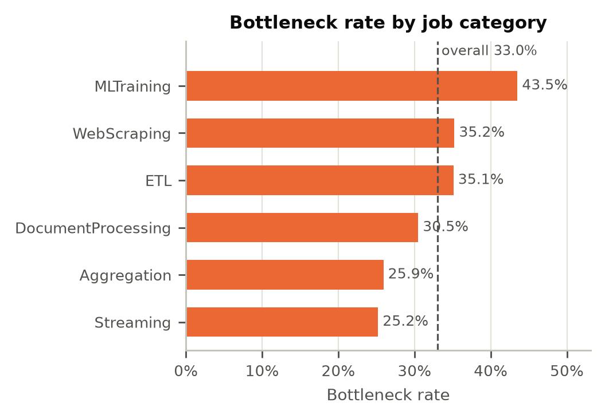
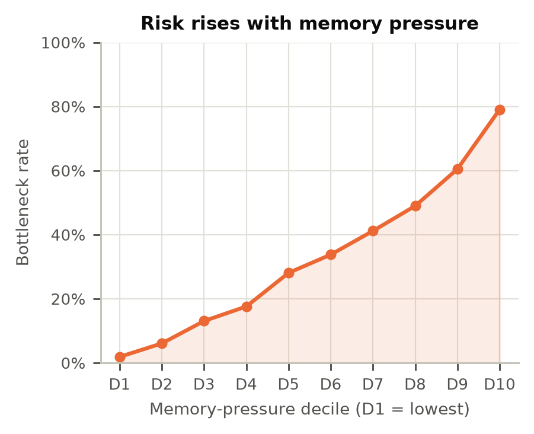
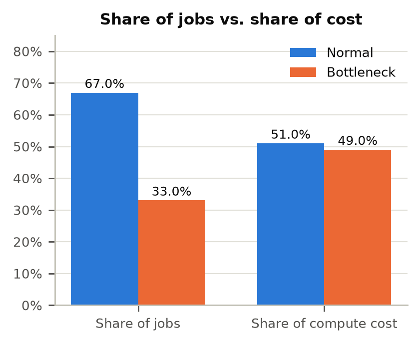
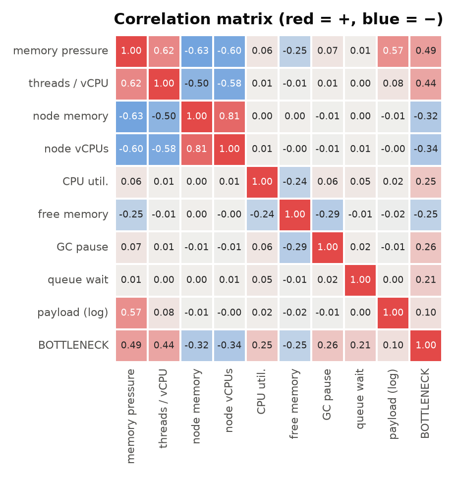
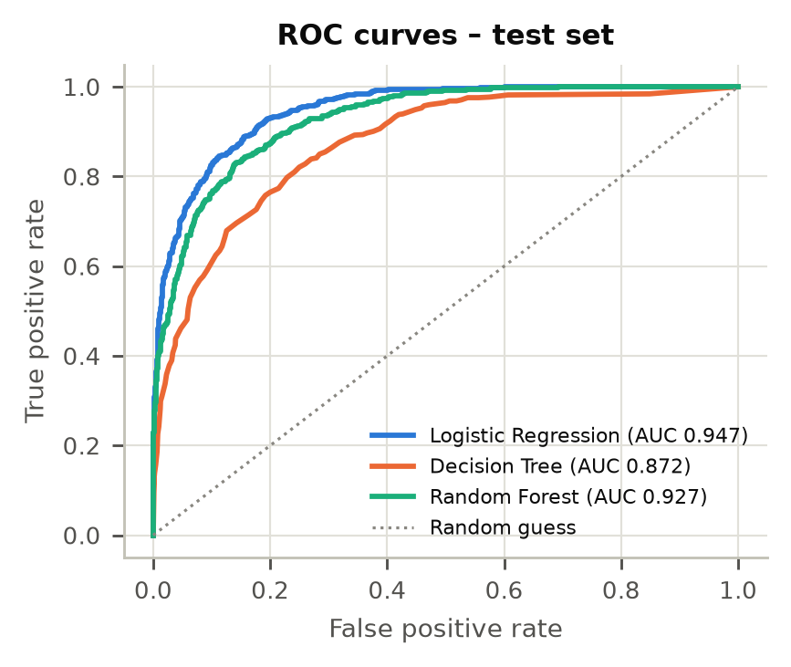
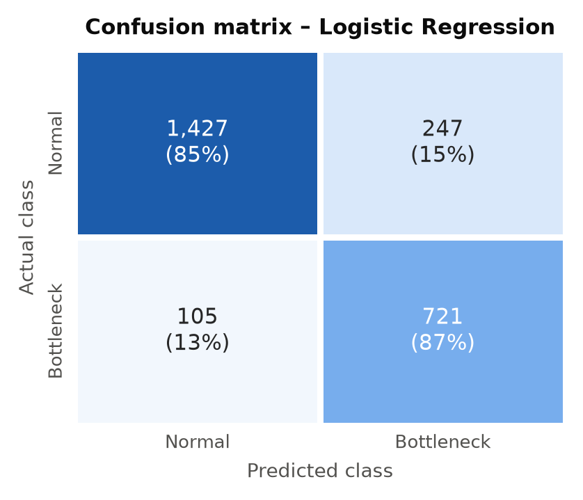
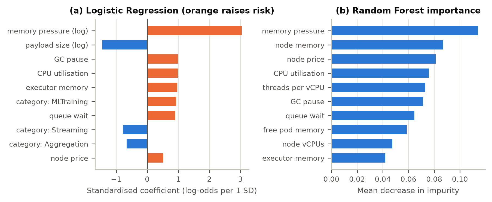

# Predicting Resource Bottlenecks and Cloud Cost Spikes in Distributed Job Processing Architectures


Individual case study for **23CSE452 Business Analytics**

| | |
|---|---|
| **Name** | Adhikkesh S K |
| **Register Number** | CB.SC.U4CSE23101 |
| **Class** | CSE-B, Amrita School of Computing, Coimbatore |
| **Report** | [Case_Study_Report.pdf](Case_Study_Report.pdf) |
| **Notebook** | [analysis.ipynb](analysis.ipynb) |

---

## About the case study

Companies that run large data jobs (web scraping, ETL, document processing, ML training) on distributed systems like
Kafka often face sudden CPU and memory bottlenecks. When a heavy job is sent to a worker node that is already busy or
low on memory, the job slows down or fails and the cloud bill goes up. Since teams cannot see this coming, they
usually over-provision the whole cluster "just in case".

In this case study I try to predict, before a job runs, whether it will cause a bottleneck. I use only information that
is available at dispatch time, and I measure how much of the cloud cost comes from these bottleneck jobs.

**Objectives**
1. Find the job and node factors that cause bottlenecks.
2. Build a classification model that flags risky jobs before they run.
3. Measure the cost impact and suggest cost-aware scheduling actions.

---

## Dataset and collection method

The data was collected in two stages. No Kaggle, UCI or GitHub dataset was used.

<p align="center">
  
</p>

1. **Web scraping (real data).** I scraped the public AWS EC2 instance comparison page
   [instances.vantage.sh](https://instances.vantage.sh/) using the Apify Web Scraper and a Python scraper (headless
   Chrome + BeautifulSoup). This gave 1,413 real cloud instance types with their memory, vCPUs, network and hourly
   prices. All 1,242 records returned by Apify matched the Python scrape.
2. **Job records built on the scraped servers.** Real company job logs are confidential, so I generated 10,000 job
   records with a Python script. Every job runs on a real scraped instance type with its real price. The job and
   node-state values (payload size, CPU load, free memory, queue wait, etc.) are simulated. The raw file also contains
   duplicates, spelling mistakes, missing values and invalid readings, which are cleaned in the notebook.

<table>
  <tr>
    <td align="center"><br><sub>Scraped website: instances.vantage.sh</sub></td>
    <td align="center"><br><sub>Apify Web Scraper setup</sub></td>
  </tr>
</table>

The data does not contain any personal or confidential information.

---

## Analysis done

- **Cleaning:** removed 35 duplicate rows, fixed 500 inconsistent labels, converted text values like "16 GiB" and
  "$0.2040 hourly" to numbers, handled invalid readings and missing values, and checked outliers with the IQR method.
- **Feature engineering:** memory pressure (payload / free node memory), threads per vCPU, peak hour, and others.
- **EDA:** 19 charts showing bottleneck rate by job type, time, node size, memory pressure, and cost.
- **Models:** Logistic Regression, Decision Tree and Random Forest with 5-fold cross-validation and a 25% test set.

### Some findings from the EDA

<table>
  <tr>
    <td align="center"><br><sub>ML training and web scraping jobs bottleneck the most</sub></td>
    <td align="center"><br><sub>Risk goes up steadily with memory pressure</sub></td>
  </tr>
  <tr>
    <td align="center"><br><sub>33% of jobs cause 49% of the cost</sub></td>
    <td align="center"><br><sub>Correlation between the main features</sub></td>
  </tr>
</table>

---

## Results

| Model | CV ROC-AUC | Accuracy | Precision | Recall | F1 | Test ROC-AUC |
|---|---|---|---|---|---|---|
| **Logistic Regression** | **0.940** | **0.859** | **0.745** | **0.873** | **0.804** | **0.947** |
| Random Forest | 0.915 | 0.845 | 0.735 | 0.832 | 0.780 | 0.927 |
| Decision Tree | 0.867 | 0.774 | 0.619 | 0.821 | 0.706 | 0.872 |

Logistic Regression gave the best result.

<table>
  <tr>
    <td align="center"><br><sub>ROC curves on the test set</sub></td>
    <td align="center"><br><sub>Confusion matrix of Logistic Regression</sub></td>
  </tr>
</table>

<p align="center">
  <br>
  <sub>Main factors behind a bottleneck (both models agree that memory pressure matters most)</sub>
</p>

**Main findings**
- Bottleneck jobs are 33% of all jobs but cause 49% of the total cost, and they run about 6 times longer.
- Memory pressure is the biggest cause. The bottleneck rate goes from about 4% in the lowest memory-pressure group to
  about 70% in the highest.
- With a threshold of 0.43, the model catches 90% of the bottleneck jobs before they run.
- Spot prices are about 67% cheaper than on-demand prices.

---

## Recommendations

| # | Recommendation | Why |
|---|---|---|
| 1 | Check payload vs free memory before dispatching, and send heavy jobs to memory-optimised nodes | Memory pressure is the biggest cause |
| 2 | Do not send new jobs to nodes that are already above 75% CPU | Busy nodes bottleneck much more often |
| 3 | Use the model as a check before dispatch, and give flagged jobs a bigger node | It catches 90% of bottlenecks early |
| 4 | Keep a separate, larger node pool for ML training and web scraping jobs | These two job types are the riskiest |
| 5 | Add extra capacity only for flagged jobs instead of the whole cluster | Saves money on over-provisioning |
| 6 | Run low-priority jobs on cheaper spot instances | Spot is about 67% cheaper |

---

## Comparison with published studies

| Study | Data | Method |
|---|---|---|
| Gao et al., IEEE Big Data 2019 | Google cluster trace | Bi-directional LSTM |
| Jassas and Mahmoud, Sensors 2022 | Google, LANL traces | DT, RF, KNN, XGBoost and others |
| Tengku Asmawi et al., Journal of Cloud Computing 2022 | Google cluster trace 2011 | LR, DT, RF, XGBoost vs LSTM |
| Saxena et al., IEEE TPDS 2023 | Google cluster, PlanetLab | Workload prediction models |

The full comparison is in Section 5 of the report.

**Limitation:** the job-level values are simulated, although the server specifications and prices are real. The exact
thresholds should therefore be checked again on real company logs.

---

## Files

| File / folder | Description |
|---|---|
| `Case_Study_Report.pdf` | Final report |
| `analysis.ipynb` | Full analysis with outputs |
| `data/cloud_job_execution_dataset.csv` | Collected dataset (before cleaning) |
| `data/cleaned_job_dataset.csv` | Cleaned dataset |
| `data/raw/scraped_instance_catalogue.csv` | Scraped instance data from instances.vantage.sh |
| `data/raw/instances_vantage_rendered.html`, `instances_vantage_screenshot.png` | Saved copy of the scraped page |
| `data/raw/apify/` | Apify Web Scraper page function, output and screenshots |
| `scripts/` | Code used for scraping and for generating the job records |
| `figures/` | Charts created by the notebook |
| `images/` | Workflow diagram used in this README |
| `results_summary.json` | Main numbers from the notebook |

## How to run

```
pip install -r requirements.txt
jupyter notebook analysis.ipynb
```

Run the notebook from the main folder of this repository.
